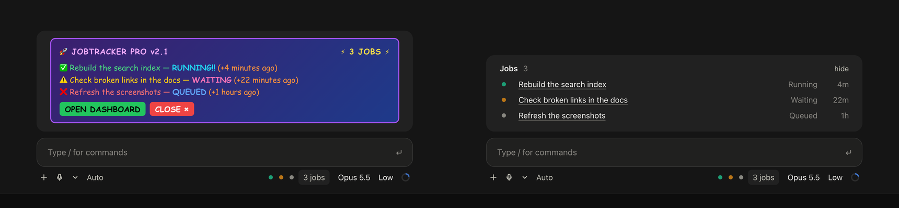

# mod-builder

A Claude Code skill for building mods. Getting a mod to work is easy. Getting it to look like it shipped with Claude Code is the hard bit.



Plenty of mods drift towards the left: a painted card, every number in its own colour, the mod's name in caps, a toast whenever something changes. This skill builds the one on the right. I went through 445 mods (224 of them draw something) plus Anthropic's own, wrote down what the good ones do, and turned every regression I hit building my own into a rule or a test (there were quite a few).

## Install
```
/plugin marketplace add noeltock/mod-builder
/plugin install mod-builder@mod-builder
```
Or copy `skills/build-claude-mod` into `~/.claude/skills/`. Needs Claude Code 2.1.287 or later.

## Use
```
/mod-builder:build-claude-mod a band above the prompt with my open PRs
```
(`/build-claude-mod` if you copied the folder instead.) Or just ask for a mod. It pins down the scope, mocks the mod in a fake desktop window before writing any code (every state is a preset you can click through), builds it, then tests each state in the terminal and the desktop app.

Not sure what a mod can even touch? Here's every place one can draw, with the names you'll use in code:


## What's in it
- `SKILL.md`: the defaults and the build loop
- `references/`: design rules, recipes, a gotchas table (white SVG boxes, blinking bars, bands that vanish), and which existing mods are worth reading
- `assets/mock-window.html`: the design mock
- `scripts/svg-check.sh`: renders an SVG the way the desktop app does, on dark and light (needs Chrome)

Mods are only days old, so some of this will age badly. PRs welcome.

MIT
