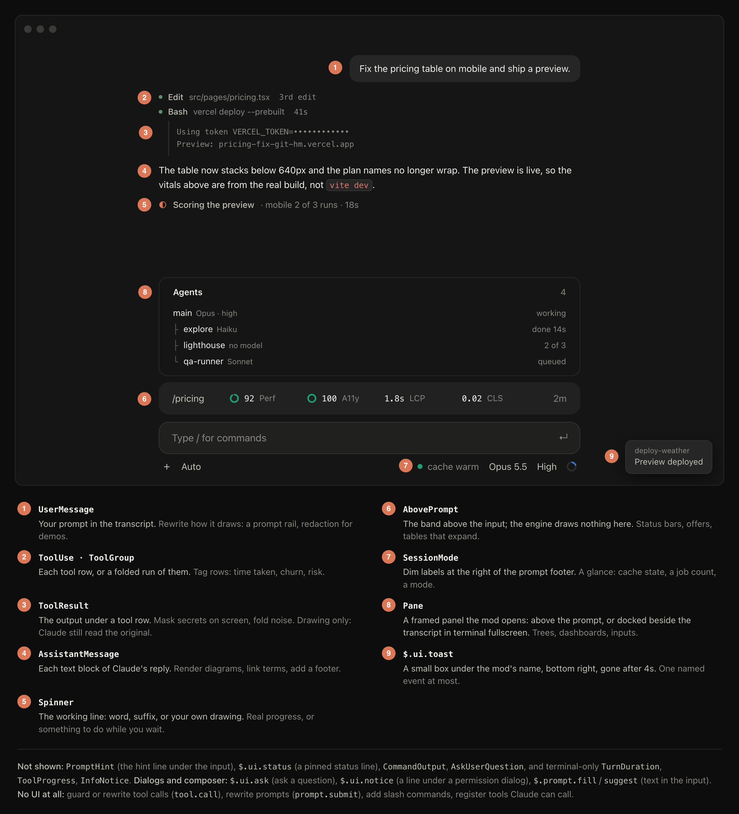

# mod-builder

A Claude Code skill for building mods that look like they shipped with Claude Code. Getting a mod to work is easy. Getting it to look like it belongs is the hard bit, and that's what this is for.



That's everywhere a mod can draw, with the names you'll use in code. Most of what goes wrong with mods comes down to the same handful of habits: painting their own boxes, colouring every number, putting their name on screen, redrawing an animation every frame, or firing when nobody asked. I went through 445 mods (224 of them draw something) plus Anthropic's own, wrote down what the good ones do differently, and turned every regression I hit building my own into a rule or a test. There were quite a few.

## What it does
- **Pins the job first:** what you see, what makes it appear, and which sessions it shows in. Out of scope means it draws nothing.
- **Designs before code:** mocks the mod in a fake Claude desktop window, with every state (hidden, collapsed, pinned, expanded, loading, offline) as a preset you can click through on localhost.
- **Builds it** as a plugin with one hooks module, after reading an existing mod of the same shape.
- **Tests every state** in the terminal and the desktop app, renders any SVG on dark and light, and won't call the desktop look done without a screenshot.
- **Ships it** with a short README and an install path that works.

## What it builds to
- Text in the app's own theme colours, bold for the value and dim for everything around it. No painted backgrounds, no mod name.
- Nothing moves when data lands. Columns are sized for their longest value, and loading rows sit in the same cells as loaded ones.
- No toasts by default. A change shows in the row.
- It detects, it doesn't act. It reads context to offer something and runs only when you ask.
- Zero model tokens unless a model call earns its place.

## Install
```
git clone https://github.com/noeltock/mod-builder.git
cp -r mod-builder/skills/build-claude-mod ~/.claude/skills/
```
Needs Claude Code 2.1.287 or later. Chrome or Chromium is optional (for the SVG check), so are `ffmpeg` and `tmux`.

## Use
Ask for a mod in plain words, or call it directly:
```
/build-claude-mod a band above the prompt with my open PRs
/build-claude-mod show my deploy status beside the model picker
/build-claude-mod fix how my mod looks on desktop
```

## What's in it
- `SKILL.md`: the defaults and the build loop
- `references/design.md`: colour, type, layout and motion rules
- `references/patterns.md`: recipes for bands, tables, rings, animated SVG, panes and triggers
- `references/gotchas.md`: why it's white, why it blinks, why the band vanished
- `references/exemplars.md`: which existing mods are worth reading first, ranked by fit and craft
- `assets/mock-window.html`: the design mock
- `scripts/svg-check.sh`: renders an SVG the way the desktop app does

Mods are only days old, so some of this will age badly. PRs welcome. MIT.
